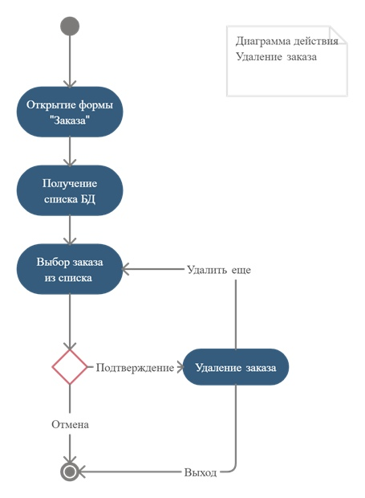

## Диаграммы действий

+ Диаграмма описывает добавление заказа в целом. 
Работник открывает форму «Клиенты», нажимает кнопку «Новый клиент», после корректного заполнения данных, у него открывается форма «Заказы», через него он переходит на форму «Новый заказ». 
На данной форме он заполняет корректно все необходимые поля, после этого нажимает на кнопку «Сохранить» и заказ сохраняется в БД

+ Диаграмма описывает добавление клиента.
 После открытия формы «Клиенты», работник нажимает на кнопку «Новый клиент» после этого сотрудник корректно заполняет данные и сохраняет его.

+ Диаграмма описывает удаление заказа. После открытия формы, работник получает список заказов из БД и может удалить его.  

+ Описание редактирования заказа. Работник открывает форму просмотр заказов, выбирает заказ и нажимает кнопку «Изменить», редактирует поля, путем выбора в списках этих полей других записей, редактирует обычные поля, и нажимает кнопку «Сохранить». 
Данные сохраняются в БД

+ Диаграмма описывает удаление и редактирование данных клиента. 
Работник открывает формы «Клиенты», выбирает нужного клиента для удаления/редактирования, если удаляет, то работник должен подтвердить, что действительно хочет удалить, если нет, то он возвращается к выборному клиенту, если подтверждает, то вся информация о клиенте удаляется из БД. 
Если работник хочет редактировать клиента, то открывается форма «Редактирование клиента» и там он выбирает, что хочет он изменить, либо личную информацию, либо данные о заказе. Если он хочет изменить личную информацию, то открывается форма клиента, работник изменяет корректно информацию, подтверждает, сохраняет, изменения сохраняются в БД. 
Если он хочет изменить данные о заказе клиента, то открывается форма «Заказ» и там работник также корректно изменяет данные, подтверждает сохраняет, изменение сохраняются в БД и выходит
