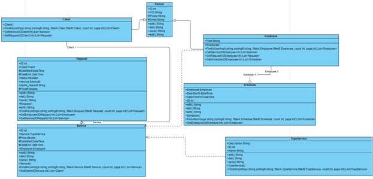

## Диаграмма классов

### Описание классов

#### *Person*
Класс, являющийся родительским для классов Client и Employee. Содержит атрибуты: ID (идентификатор), FIO (фамилия имя и отчество работника/клиента), E-Mail (адрес почты), Phone (номер телефона). Является абстрактным.

+ +add():String - функция, которая позволяет добавлять работника/клиента(1) 
+ +del():String – функция, которая позволяет удалять данные о работнику/клиенте(2) 
+ +edit():String – функция, которая позволяет редактировать данные о работнике/клиенте(3) 
+ +save():String – функция, которая позволяет сохранять данные о работнике/клиенте(4)

#### *Employee*

Класс, являющийся наследником класса Person.
 Содержит атрибуты: Post (Должность).
+ +Employee() – конструктор класса без параметров
+ +FindAll(sortingA:string,sortingB:string, filterA:Employee,filterB:Employee, count:int, page:int):List<Employee>— функция, возвращающая всех сотрудников, удовлетворяющих заданным параметрам.(5) Параметры:
    * sortingA: string — отвечает, по какому полю будет сортироваться список;
    * sortingB: string — отвечает, по возрастанию или убыванию будут сортироваться элементы;
    * filterA: Employee — отвечает за фильтрацию;
    * filterB: Employee —необходим для количественных атрибутов;
    * count: int — отвечает, сколько элементов необходимо показать;
    * page: int — отвечает, с какой страницы начинать поиск элементов.
+ +GetService(IDEmployee:Int):List<Service> - функция, возвращающая список работников, оказывающих услугу.
+ +GetRequest(IDEmployee:Int):List<Request> - функция, возвращающая список заказов, оказывающие работниками.
+ +GetSchedule(IDEmployee:Int):List<Schedule> функция, возвращающая расписание работника.

#### *Client*

Класс, являющийся наследником класса Person. Не содержит атрибут
+ Client()— конструктор класса без параметров.
+ +FindAll(sortingA:string,sortingB:string, filterA:Client,filterB:Client, count:int, page:int):List<Client> -  аналогична (5) функции
+ +GetService(IDClient:Int):List<Service> функция, возвращающая список услуг, которые оказывались/оказываются клиенту.
+ +GetRequest(IDClient:Int):List<Request>  - функция, возвращающая список заказов клиентов.

#### *Schedule*

Класс, связанный агрегацией «один-ко-многим» с классом Employee. Содержит атрибуты: DateFinish (время конца смены), DateStart (время начала смены), Worker (работник).
+ +Edit() – аналогична (3) функции;
+ +Add() – аналогична (1) функции; 
+ +Del() – аналогична (2) функции;
+ GetInfo(Employee: Employee, DateStart:DateTime) : Schedule schedule – Возвращает расписание работника. 
+ +Schedule() – конструктор класса без параметров 
+ +FindAll(sortingA:string,sortingB:string, filterA:Schedule,filterB:Schedule, count:int, page:int):List<Schedule> - аналогична (5) функции
+GetEmployee(IDSchedule:Int):List<Employee> функция, возвращающая работников, которые работают в определенный день.
 
#### *Service*

Содержит атрибуты: ID(идентификатор), Service(тип и описание услуги), Price(стоимость услуги), DateStart(дата начала), DateFinish(примерное дата завершение), Employee(сотрудник).
+ +Service() – конструктор класса без параметров. 
+ +add():String – аналогичен (1) функции.
+ +edit():String – аналогичен (3) функции.
+ +save():String -аналогичен (4) функции.
+ +del():String – аналогичен(2) функции.
+ +FindAll(sortingA:string,sortingB:string, filterA:Service,filterB:Service, count:int, page:int):List<Service> - аналогична (5) функции
+ +GetClient(IDService:Int):List<Client> - функция возвращает список клиентов, у которых была данная услуга

#### *TypeService*

Содержит атрибуты: Description(описание услуги),ID(идинтификатор),Name(название услуги)
+ +add():String – аналогичен (1) функции
+ +del():String – аналогичен (2) функции
+ +save():String – аналогичен (4) функции
+ +TypeService() – конструктор класса без параметров
+ +FindAll(sortingA:string,sortingB:string, filterA:TypeService,filterB:TypeService, count:int, page:int):List<TypeService> - аналогична (5) функции

#### *Request*

Содержит атрибуты: (идентификатор), (клиент), (дата начала заказа), (примерная дата завершения), (статус), (услуга), (название заказа), (стоимость заказа)
+ +Add():String - аналогичен (1) функции
+ +Del():String -аналогичен (2) функции
+ +Edit():String -аналогичен (3) функции
+ +Save():String -аналогичен (4) функции
+ Request() - конструктор класса без параметров. 
+ +FindAll(sortingA:string,sortingB:string, filterA:Request,filterB:Request, count:int, page:int):List<Request> - аналогична (5) функции
+ +GetEmployee(IDRequest:Int):List<Employee> - функция, возвращающая список сотрудников ,которые занимаются данным заказом
+ +GetService(IDRequest:Int):List<Service> - функция, возвращающая список услуг, которые есть в заказе. 

