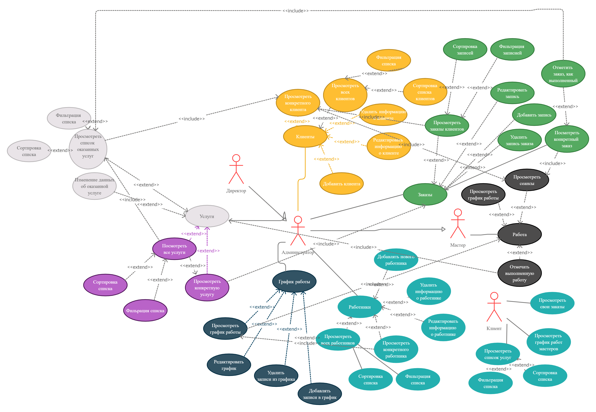

## Диаграмма прецедентов 

 

**Пункт 1 Посмотреть заказы клиентов**
+ *Имя прецедентов:*	Просмотреть заказы клиентов 
+ *Краткое описание:*	Прецедент позволяет просматривать список всех заказов
+ *Актеры:*	Администратор, Директор 
+ *Предусловия:*	-
+ *Основной поток:*	Выводится информация о текущих, а также и завершившихся заказах
+ *Постусловия:*	Если прецедент был успешен завершён, то пользователь может выполнять другие действия
+ *Альтернативные потоки:* 	-

**Пункт 2 Удалить заказ**
+ *Имя прецедентов:*	Удалить заказ
+ *Краткое описание:*	Прецедент позволяет удалять завершившуюся заказ
+ *Актеры:*	Администратор, Директор
+ *Предусловия:*	Должен быть выполнен прецедент “Просмотреть заказов”
+ *Основной поток:*	При нажатии на кнопку “Удалить”, текущая запись удаляется.
+ *Постусловия:*	Если прецедент был успешен завершён, то данный заказ удаляется из БД
+ *Альтернативные потоки:* 	-

**Пункт 3 Просмотреть конкретного заказа**
+ *Имя прецедентов:*	Просмотреть конкретный заказ 
+ *Краткое описание:*	Прецедент позволяет просматривать конкретный заказ
+ *Актеры:*	Администратор, Директор, мастер. 
+ *Предусловия:*	Должен быть выполнен прецедент «Просмотреть заказы»
+ *Основной поток:*	Выводится информация о заказе
+ *Постусловия:*	Если прецедент был успешен завершён, то пользователь может выполнять другие действия
+ *Альтернативные потоки:* 	-

**Пункт 4 Просмотреть статус заказа**
+ *Имя прецедентов:*	Просмотреть статус заказа
+ *Краткое описание:*	Прецедент позволяет просматривать статусы всех заказов
+ *Актеры:*	Администратор, директор
+ *Предусловия:*	Должен быть выполнен прецедент “Просмотреть заказы”
+ *Основной поток:*	Выводится информация о статусах заявок
+ *Постусловия:*	Если прецедент был успешен завершён, то пользователь может выполнять другие действия
+ *Альтернативные потоки:* 	-

**Пункт 5 Редактировать заказ**
+ *Имя прецедентов:*	Редактировать заказ
+ *Краткое описание:*	Прецедент позволяет редактировать текущие заявки заявок 
+ *Актеры:*	Директор, администратор
+ *Предусловия:*	Должен быть выполнен прецедент “Просмотреть заказы”
+ *Основной поток:*	Открывается форма редактирования заказа, где изменяются необходимые данные.
+ *Постусловия:*	Если прецедент был успешно завершен, то форма редактирования заказа закрывается, и измененные данные сохраняются
+ *Альтернативные потоки:* 	Если имеются пустые поля, либо введены некорректные данные, то пользователю выдается сообщение об ошибке и дается возможность исправить данные.

**Пункт 6 Новый заказ**
+ *Имя прецедентов:*	Новая заказ 
+ *Краткое описание:*	Прецедент позволяет добавить новый заказ
+ *Актеры:*	Администратор
+ *Предусловия:*	-
+ *Основной поток:*	Открывается форма создании заказа, где вводиться необходимые данные.
+ *Постусловия:*	Если прецедент был успешно завершен, то форма создании заказов закрывается, и добавленные данные сохраняются
+ *Альтернативные потоки:* 	Если имеются пустые поля, либо введены некорректные данные, то пользователю выдается сообщение об ошибке и дается возможность исправить данные.

**Пункт 7 Добавление работника**
+ *Имя прецедентов:*	Добавление работника 
+ *Краткое описание:*	Прецедент позволяет добавлять работника в БД 
+ *Актеры:*	Заведующий склада
+ *Предусловия:*	Должен быть выполнен прецедент «Просмотреть список работников»
+ *Основной поток:*	Открывается форма добавлении работника, где вводиться необходимые данные.
+ *Постусловия:*	Если прецедент был успешно завершен, то форма добавлении работника закрывается, и добавленные данные сохраняются
+ *Альтернативные потоки:* 	Если имеются пустые поля, либо введены некорректные данные, то пользователю выдается сообщение об ошибке и дается возможность исправить данные.

**Пункт 8 Просмотреть список работников**
+ *Имя прецедентов:*	Просмотреть список работников
+ *Краткое описание:*	Прецедент позволяет просматривать список всех работников 
+ *Актеры:*	Администратор, директор
+ *Предусловия:*	Должен быть хотя бы один работник. Если таковых нет, то пользователю предлагается внести нового работника в БД
+ *Основной поток:*	Выводится список работников
+ *Постусловия:*	Если прецедент был успешен завершён, то пользователь может выполнять другие действия
+ *Альтернативные потоки:* 	-

**Пункт 9 Удаление работника из БД**
+ *Имя прецедентов:*	Удаление работника
+ *Краткое описание:*	Прецедент позволяет удалять работников из базы данных 
+ *Актеры:*	Директор 
+ *Предусловия:*	Должен быть выполнен прецедент “Просмотреть работников”
+ *Основной поток:*	Удаляется вся информации работника из базы данных
+ *Постусловия:*	Если прецедент был успешен завершён, то информация о работнике удаляется из БД
+ *Альтернативные потоки:* 	-

**Пункт 10 Просмотреть информации конкретного работника**
+ *Имя прецедентов:*	Просмотреть информации конкретного работника
+ *Краткое описание:*	Прецедент позволяет просматривать информацию конкретного человека 
+ *Актеры:*	Директор, администратор
+ *Предусловия:*	Должен быть хотя бы один работник. Если таковых нет, то пользователю предлагается внести нового работника в БД
+ *Основной поток:*	Выводится информация о работнике, работающий на складе
+ *Постусловия:*	Если прецедент был успешен завершён, то пользователь может выполнять другие действия
+ *Альтернативные потоки:* 	-

**Пункт 11 Редактировать информацию о работнике**
+ *Имя прецедентов:*	Редактировать информацию о работнике
+ *Краткое описание:*	Прецедент позволяет редактировать информацию работника
+ *Актеры:*	Директор, администратор 
+ *Предусловия:*	Должен быть хотя бы один работник. Если таковых нет, то пользователю предлагается внести нового работника в БД
+ *Основной поток:*	Открывается форма редактирования работника, где изменяются необходимые данные.
+ *Постусловия:*	Если прецедент был успешно завершен, то форма редактирования работника закрывается, и измененные данные сохраняются
+ *Альтернативные потоки:* 	Если имеются пустые поля, либо введены некорректные данные, то пользователю выдается сообщение об ошибке и дается возможность исправить данные.

**Пункт 12 Просмотреть сеансы**
+ *Имя прецедентов:*	Просмотреть сеансы
+ *Краткое описание:*	Прецедент позволяет просматривать сеансы мастера
+ *Актеры:*	Мастер, администратор, директор
+ *Предусловия:*	Должен быть хотя бы один заказ. Если таковой нету, то пользователю предлагается внести новую технику в БД
+ *Основной поток:*	Выводиться дата и время заказа
+ *Постусловия:*	Если прецедент был успешен завершён, то пользователь может выполнять другие действия
+ *Альтернативные потоки 	-

**Пункт 13 Отмечать выполненную работу** 
+ *Имя прецедентов:*	Отмечать выполненную работу 
+ *Краткое описание:*	Прецедент позволяет отмечать выполненные заказы 
+ *Актеры:*	Мастер
+ *Предусловия:*	Должен быть хотя бы один действующий заказ.
+ *Основной поток:*	Отмечает выполненную работу 
+ *Постусловия:*	Если прецедент был успешен завершён, то пользователь может выполнять другие действия
+ *Альтернативные потоки:* 	-

Остальные прецеденты аналогичны прецедентам, описанным в пунктах (1-13).
