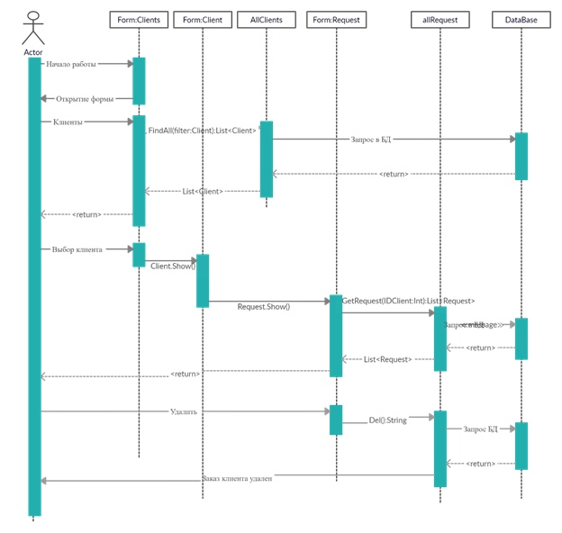
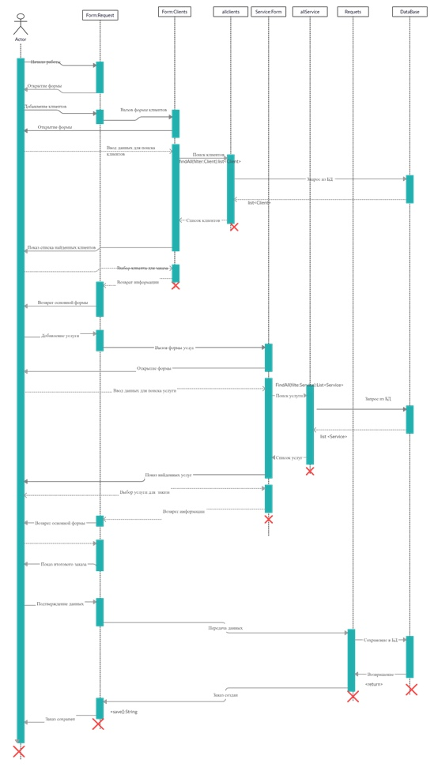
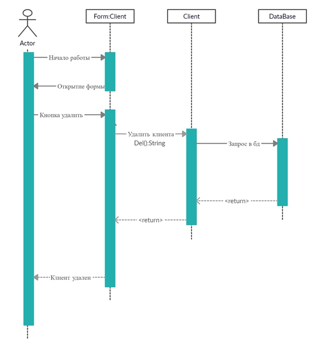

### Диаграммы последовательности

+ Диаграмма описывает процесс удаление заказа у клиента. Работник начинает работу на форме. 
Ищет клиента, получаемых функцией получения списка клиентов. 
Открывается форма клиента и через него переходим к его заказам/заказу, получаемый функцией получения списка заказов. И удаляет заказ из БД  
 

+ Диаграмма описывает процесс создание заказа. Работник начинает работу на форме.
Добавляет клиентов, получаемых функцией получения списка клиентов. 
Добавляет услуги, получаемые функцией получение списка услуг. 
И подтверждает формирование заказа, сохраняя его.  

+ Описание процесса удаления клиента. Работник выбирает клиента на форме списка клиентов и нажимает кнопку «Удалить».
Вызывается функция «Del» класса «Client», запрос на удаление пациента в БД, удаление пациента из БД, сообщение об удалении пациента.
 
