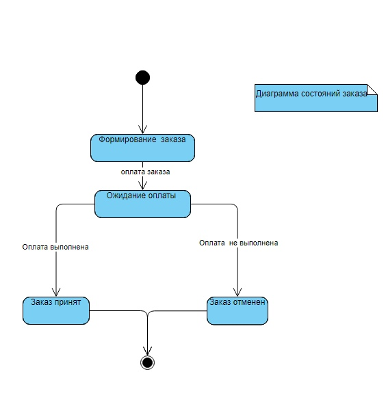

## Диаграмма состояния

+ Диаграмма описывает все возможные состояния заказа на продолжении его жизненного цикла. 
Исходный заказ является пустым, далее, после формирования, определяется его стоимость.  
Если оплата по заказу выполнена – ему присваивается статус «заказ принят», если оплата не выполнена – «заказ отменен». 
